# ☕ 커피숍 주문 시스템

> 다수의 서버 인스턴스 환경에서도 데이터 정합성과 동시성을 보장하는 커피숍 주문 플랫폼

<br>

## 📌 목차

1. [프로젝트 개요](#-프로젝트-개요)
2. [기술 스택](#-기술-스택)
3. [시스템 아키텍처](#-시스템-아키텍처)
4. [ERD](#-erd)
5. [패키지 구조](#-패키지-구조)
6. [API 명세](#-api-명세)
7. [핵심 설계 결정](#-핵심-설계-결정)
8. [K6 부하 테스트 결과](#-k6-부하-테스트-결과)
9. [트러블슈팅](#-트러블슈팅)
10. [실행 방법](#-실행-방법)

<br>

---

## 🧭 프로젝트 개요

### 서비스 소개

본 서비스는 앱 기반 커피숍 주문 플랫폼으로, 메뉴 조회부터 포인트 충전, 주문 및 결제까지 모든 과정을 처리하는 시스템입니다.

단순한 주문 시스템을 넘어 **다수의 서버 인스턴스 환경에서도 데이터 정합성과 동시성을 보장**하며, 실시간 인기 메뉴 추천까지 제공하는 것을 목표로 설계했습니다.

### 핵심 설계 가치

| 가치 | 설명 |
|------|------|
| **일관성** | 어느 서버 인스턴스로 요청이 가도 동일한 결과 보장 |
| **동시성** | 동시 주문이 몰려도 포인트 잔액 정합성 보장 |
| **확장성** | 트래픽이 늘어도 안정적으로 수평 확장 가능한 구조 |

### 핵심 구현 기능

- 커피 메뉴 목록 조회 / 상세 조회 / 검색
- 포인트 충전 및 포인트로 주문/결제/취소(환불)
- 주문 내역 데이터 수집 플랫폼 실시간 전송 (Kafka 비동기)
- 최근 7일 인기 메뉴 TOP 3 조회 (Redis Sorted Set)
- JWT 기반 인증 + Redis 블랙리스트 로그아웃

<br>

---

## 🛠 기술 스택

### Backend
| 분류 | 기술 |
|------|------|
| Language |  |
| Framework |  |
| Security |   |
| Build |  |
| ORM |   |

### Infrastructure
| 분류 | 기술 | 용도 |
|------|------|------|
| Database |  | 주문/유저/메뉴 데이터 저장 |
| Cache / Lock |  | 메뉴 캐싱, 분산락, 인기메뉴 집계, JWT 블랙리스트 |
| Message Broker |  | 주문 이벤트 비동기 처리 |
| Container |  | 로컬 인프라 구성 |

### Test / Monitoring
| 분류 | 기술 |
|------|------|
| 부하 테스트 |  |
| Redis UI |  |
| Kafka UI |  |
| API 테스트 |  |


### 버전 고정 이유

```
jackson-bom       : 2.17.2
spring-data-bom   : 2024.0.8  (spring-data-redis 3.5.x Redis 역직렬화 버그로 다운그레이드)
```

`spring-data-redis 3.5.x`에서 `GenericJackson2JsonRedisSerializer` 내부 구현 버그로 `MismatchedInputException`이 발생하여 `2024.0.8`로 버전을 고정했습니다.

자세한 내용은 [트러블슈팅](#-트러블슈팅) 을 참조해주세요.

<br>

---

## 🏗 시스템 아키텍처

### 멀티 인스턴스 환경 고려

본 시스템은 로드밸런서를 통해 요청이 여러 인스턴스로 분산되는 환경을 가정하여 설계했습니다.

이 환경에서 발생할 수 있는 동시성 문제를 해결하기 위해 모든 인스턴스가 동일한 Redis를 바라보는 구조를 채택했습니다.

```
[멀티 인스턴스 환경]

           Load Balancer
          /             \
   Instance A       Instance B
          \             /
        Redis (공유)  ← 분산락, 캐시, 블랙리스트
        MySQL (공유)  ← 주문/유저 데이터
        Kafka (공유)  ← 이벤트 브로커
```

### 주문 처리 흐름

```
[POST /api/orders]
       │
       ▼
OrderFacade  ← Redis 분산락 획득 (lock:order:{userId})
       │
       ▼
OrderService (@Transactional)
  ├─ 유저 조회 (비관락)
  ├─ 포인트 차감
  ├─ 포인트 이력 기록
  ├─ 주문 저장 (CREATED)
  └─ OrderCreatedEvent 발행 (JVM 내부)
── DB COMMIT ──
       │
       ▼
OrderEventListener (@TransactionalEventListener AFTER_COMMIT)
  └─ Kafka order 토픽 발행
       │
       ▼
OrderListener (Kafka Consumer)
  ├─ processOrderCompleted()  ← 주문 상태 CREATED → COMPLETED (@Transactional)
  └─ updatePopularMenus()     ← Redis Sorted Set 카운터 갱신 (트랜잭션 밖)
```

<br>

---

## 🗂 ERD

<div align="center">

**ERD**

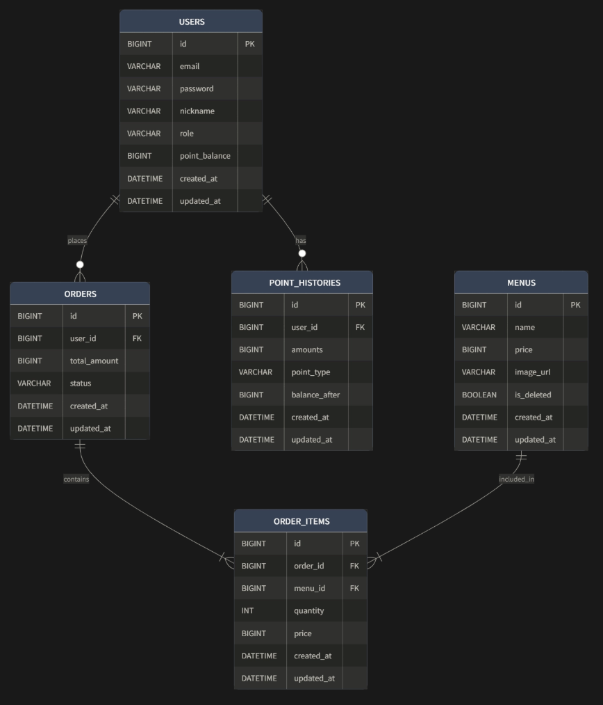

</div>

| 테이블 | 설명 |
|--------|------|
| users | 유저 정보 (이메일, 비밀번호, 포인트 잔액, 역할) |
| menus | 메뉴 정보 (이름, 가격, 이미지, 소프트 딜리트) |
| orders | 주문 정보 (유저, 총액, 상태) |
| order_items | 주문-메뉴 중간 테이블 (수량, 주문 당시 가격, order_id/menu_id 복합 유니크) |
| point_histories | 포인트 거래 이력 (충전/결제/환불, amounts/balance_after) |

<br>

---

## 📁 패키지 구조

```
src/main/java/com/example/kserverproject/
├── common/
│   ├── config/
│   │   ├── aop/          # 로깅 AOP
│   │   ├── init/         # DataInitializer (로컬 더미 데이터)
│   │   ├── kafka/        # Kafka Producer/Consumer/Topic 설정
│   │   ├── querydsl/     # QueryDSL 설정
│   │   ├── redis/        # RedisConfig, RedisLockService (Redisson)
│   │   └── security/     # SecurityConfig, PasswordEncoderConfig
│   ├── dto/response/     # 공통 응답 (ApiResponse, ErrorResponse, PageResponseDto)
│   ├── entity/           # BaseEntity (JPA Auditing)
│   ├── exception/        # 도메인별 예외, GlobalExceptionHandler, ErrorCode
│   └── jwt/              # JwtUtil, JwtFilter, CustomUserDetails
│
└── domain/
    ├── auth/             # 회원가입, 로그인, 로그아웃 (Redis 블랙리스트)
    ├── user/             # 유저 정보 조회
    ├── menu/             # 메뉴 조회/검색 (Redis 캐시), 관리자 메뉴 CRUD, 인기메뉴 집계
    ├── order/            # 주문 생성/조회/취소, Kafka 이벤트 발행/수신, Facade 패턴
    └── pointHistory/     # 포인트 충전, 잔액 조회, 거래 내역 (CHARGE/PAYMENT/REFUND)
```

> Kafka 관련 설정(`Producer`, `Consumer`, `Topic`)은 `common/config/kafka/` 하위에 위치하며,
> 주문 이벤트의 발행(`OrderEventListener`)과 수신(`OrderListener`)은 `domain/order/` 하위에서 담당합니다.

<br>

---

## 📋 API 명세

### 인증 (Auth)

| Method | Endpoint | 인증 | 설명 |
|--------|----------|------|------|
| POST | `/api/auth/signup` | ❌ | 회원가입 |
| POST | `/api/auth/login` | ❌ | 로그인 (JWT 발급) |
| POST | `/api/auth/logout` | ✅ | 로그아웃 (Redis 블랙리스트 등록) |

### 유저 (User)

| Method | Endpoint | 인증 | 설명 |
|--------|----------|------|------|
| GET | `/api/users/me` | ✅ CUSTOMER | 내 정보 조회 |

### 포인트 (Point)

| Method | Endpoint | 인증 | 설명 |
|--------|----------|------|------|
| GET | `/api/points/me` | ✅ CUSTOMER | 포인트 잔액 조회 |
| POST | `/api/points/me/charge` | ✅ CUSTOMER | 포인트 충전 |
| GET | `/api/points/me/histories` | ✅ CUSTOMER | 포인트 거래 내역 조회 |

### 메뉴 (Menu)

| Method | Endpoint | 인증 | 설명 |
|--------|----------|------|------|
| GET | `/api/menus` | ❌ | 메뉴 목록 전체 조회 |
| GET | `/api/menus/{menuId}` | ❌ | 메뉴 단건 조회 |
| GET | `/api/menus/popular` | ❌ | 인기 메뉴 TOP 3 조회 |
| GET | `/api/menus/search` | ❌ | 메뉴 검색 |
| POST | `/api/admin/menus` | ✅ ADMIN | 메뉴 등록 |
| PATCH | `/api/admin/menus/{menuId}` | ✅ ADMIN | 메뉴 수정 |
| DELETE | `/api/admin/menus/{menuId}` | ✅ ADMIN | 메뉴 삭제 |

### 주문 (Order)

| Method | Endpoint | 인증 | 설명 |
|--------|----------|------|------|
| POST | `/api/orders` | ✅ CUSTOMER | 주문 + 포인트 결제 |
| GET | `/api/orders/{orderId}` | ✅ CUSTOMER | 특정 주문 상세 조회 |
| GET | `/api/orders/me` | ✅ CUSTOMER | 내 주문 목록 조회 |
| POST | `/api/orders/{orderId}/cancel` | ✅ CUSTOMER | 주문 취소 (포인트 환불) |


> 자세한 요청/응답 스펙은 **[API 상세 명세서](./docs/API_DOCS.md)** 를 참고해 주시면 감사하겠습니다.


---

## 🔍 핵심 설계 결정

### 1. JWT + Redis 블랙리스트 로그아웃

JWT는 Stateless 구조라 서버가 토큰 상태를 저장하지 않다보니, 로그아웃 시 클라이언트에서 토큰을 삭제해도 해당 토큰은 만료시간 전까지 서버에서 여전히 유효하다는 문제가 있습니다.

멀티 인스턴스 환경에서 Session 방식은 인스턴스마다 세션 저장소가 필요하지만, JWT는 토큰 자체에 인증 정보가 담겨있어 어느 인스턴스로 요청이 가도 검증만 하면 된다고 생각하여 JWT를 선택했습니다.

로그아웃 문제는 Redis 블랙리스트로 해결했습니다. 로그아웃 시 해당 토큰을 Redis에 저장하고, 이후 요청마다 블랙리스트 여부를 확인합니다.

TTL을 토큰의 남은 만료시간으로 설정한 이유는 토큰이 만료되는 시점에 Redis에서도 자동으로 삭제가 되어 메모리 관리에 용이하다고 생각했습니다.

```
로그아웃 요청
→ 토큰 남은 만료시간 계산
→ Redis: "blacklist:{token}" = "logout" (TTL = 남은 만료시간)
→ 이후 API 요청 시 JwtFilter에서 블랙리스트 여부 확인
```

<div align="center">

**Redis-blacklist**

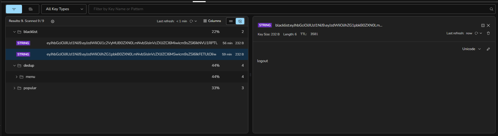

</div>

---

### 2. 동시성 제어 전략 — 비관락 vs Redis 분산락

동시성 이슈가 발생할 수 있는 지점은 **포인트 충전/취소**와 **주문/결제** 두 가지를 생각했고, 두 상황의 특성이 다르기 때문에 서로 다른 전략을 선택했습니다.

#### 포인트 충전 / 주문 취소 → 비관락 (PESSIMISTIC_WRITE)

충전과 취소는 발생 빈도가 낮고 정합성이 최우선인 작업이라고 판단하여, 빈도가 낮다는 건 DB 커넥션을 잠깐 점유하더라도 커넥션 풀 고갈로 이어질 가능성이 낮다고 생각했습니다.

```
충전/취소 빈도   → 낮음
정합성 요구      → 높음
커넥션 고갈 위험 → 낮음

→ 비관락으로 단순하고 확실하게 정합성 보장
```

#### 주문/결제 → Redis 분산락 (Redisson RLock)

주문은 인기 메뉴 출시나 이벤트 상황에서 트래픽이 몰릴 가능성이 높은 트랜잭션이라고 생각을 했습니다.

멀티 인스턴스 환경에서 로드밸런서를 통해 동일 유저의 요청이 서로 다른 인스턴스로 라우팅되면 아래와 같은 문제가 발생할 수 있습니다.

```
인스턴스 A → 유저 잔액 조회 → 5,000P 확인
인스턴스 B → 유저 잔액 조회 → 5,000P 확인 (동시에)
→ 두 인스턴스 모두 3,000P 차감 시도 → 잔액이 -1,000P가 되는 문제 발생할 수 있습니다.
```

비관락을 주문에 적용하면 동시 주문이 몰릴 때 DB 커넥션 풀 고갈 위험이 있다고 판단했습니다.

반면, Redis 분산락은 DB 커넥션과 완전히 분리되어 주문이 몰려도 DB 부하가 없다는 점에서 더 적합하다고 생각했습니다.

**Lettuce 스핀락이 아닌 Redisson RLock을 선택한 이유**

Lettuce는 락 획득 실패 시 Redis에 반복적으로 재시도 요청(스핀락)을 보내 트래픽이 몰릴수록 Redis 부하가 증가하는데,

Redisson은 Pub/Sub 방식으로 락 해제 알림을 받을 때만 획득을 시도하여 불필요한 Redis 요청이 없어서 적합하다고 생각했습니다.


```java
// 락 키: userId 기준 → 같은 유저의 동시 주문만 직렬화, 다른 유저 영향 없음
redisLockService.executeWithLock("lock:order:" + userId, () ->
    orderService.createOrder(userId, requestDto)
);
// waitTime: 3초, leaseTime: 5초
```

---

### 3. Facade 패턴 — 락과 트랜잭션 순서 보장

`@Transactional` 메서드 내부에서 분산락을 잡으면 락 해제 시점(람다 종료)보다 DB 커밋 시점이 늦어지는 문제가 발생할 수 있습니다.

```
락 해제 → (아직 커밋 안 됨) → 다른 스레드 락 획득 → 이전 잔액 읽기 → Race Condition
```

`OrderFacade`를 도입하여 **Facade는 `@Transactional`이 없고, Service는 `@Transactional`을 갖는** 구조로 분리하는 것이

락과 트랜잭션의 순서를 보장할 수 있다고 판단했습니다.

```
락 획득
  └─ OrderService.createOrder() 호출
       └─ @Transactional 시작
       └─ 비즈니스 로직
       └─ DB COMMIT 완료  ← 메서드 반환
  └─ 람다 종료
락 해제  ← 커밋 이후 보장
```

---

### 4. Kafka — 주문 이벤트 비동기 처리

주문 트랜잭션 내에서 데이터 수집 플랫폼 전송을 동기로 처리하면 두 가지 문제가 발생할 수 있습니다.

```
문제 1. 강한 결합  → 외부 서버 장애 시 주문 트랜잭션 롤백
문제 2. 응답 지연  → 외부 서버 응답이 느리면 주문 API도 같이 느려짐
```

Kafka로 이벤트를 발행하면 주문 트랜잭션은 즉시 완료되고, Consumer가 비동기로 처리하여 이 문제를 해결할 수 있다고 판단했습니다.

**@TransactionalEventListener(AFTER_COMMIT) 도입 이유**

`@Transactional` 메서드 안에서 `kafkaTemplate.send()`를 직접 호출하면 DB 커밋 전에 Kafka 메시지가 브로커에 도달하는데,

이후 DB 롤백 발생 시 DB에는 주문 정보가 없는데 Kafka에는 메시지가 이미 들어간 **유령 이벤트**가 발생하는 문제가 있었습니다.

이를 방지하기 위해 `AFTER_COMMIT` 시점에만 Kafka 발행을 실행하는 구조를 선택했습니다.

```
OrderService (@Transactional)
  └─ DB 작업 완료
  └─ eventPublisher.publishEvent(OrderCreatedEvent)  ← JVM 내부 이벤트만 발행
── DB COMMIT ──
OrderEventListener (@TransactionalEventListener AFTER_COMMIT)
  └─ orderProducer.send()  ← 커밋 완료 후에만 Kafka 발행
```

**DLT + FixedBackOff 재시도**

Consumer 처리 실패 시 메시지 유실을 방지하기 위해 1초 간격으로 2회 재시도 후, 그래도 실패하면 `order-dlt` 토픽으로 이동시키는 전략을 선택했습니다.

1초 간격은 일시적인 네트워크 오류나 Redis 순간 장애가 보통 수백ms ~ 1초 내에 복구된다는 판단에서 결정했습니다.

```java
FixedBackOff(1000L, 2L)  // 1초 간격, 2회 재시도 (총 3회)
```

<div align="center">

**Kafka - Ui (토픽 목록, order-dlt 메시지, Consumer Group Lag 0)**

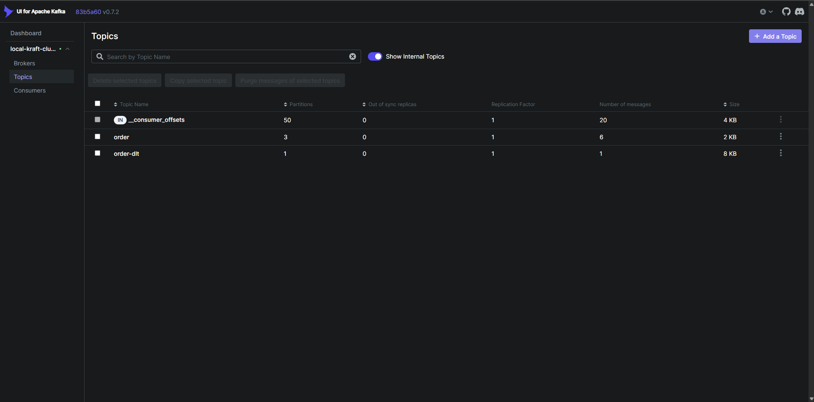
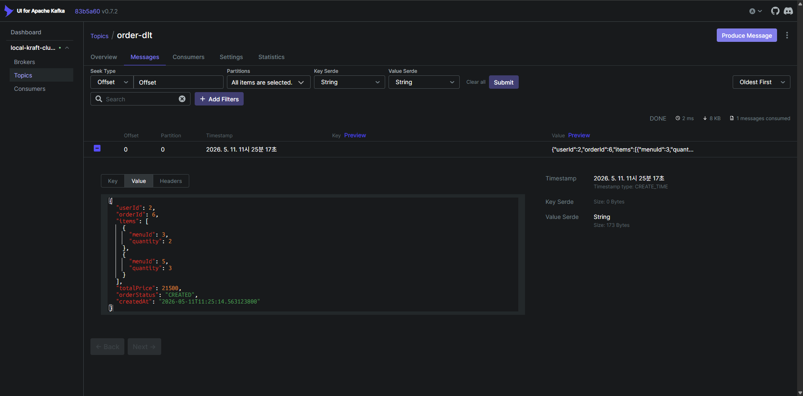
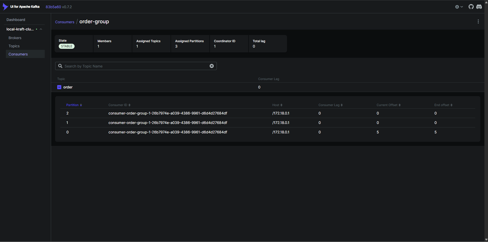

</div>

---

### 5. Redis 캐시 — 메뉴 목록 (StringRedisTemplate 직접 구현)

메뉴 데이터는 읽기 빈도는 높고 변경 빈도는 낮은 전형적인 캐싱 대상이라고 생각했습니다.

초기에는 `@Cacheable + GenericJackson2JsonRedisSerializer` 조합으로 구현하였으나,

`spring-data-redis 3.5.x`에서 역직렬화 버그로 `MismatchedInputException`이 발생했습니다.

`StringRedisTemplate + ObjectMapper` 직접 구현으로 전환하면 직렬화/역직렬화 흐름을 제어했습니다.

```
책임 분리 구조
MenuRedisService  ← Redis 읽기/쓰기/삭제 전담
MenuService       ← 캐시 hit/miss 판단 후 MenuRedisService 호출
AdminMenuService  ← 메뉴 등록/수정/삭제 시 evict 호출
```

TTL은 30분으로 설정하되, 메뉴 등록/수정/삭제 시 `evictMenusAll()`로 즉시 무효화하여 데이터 정합성을 보장했습니다.

<div align="center">

**RedisInsight - menus:all 캐시**

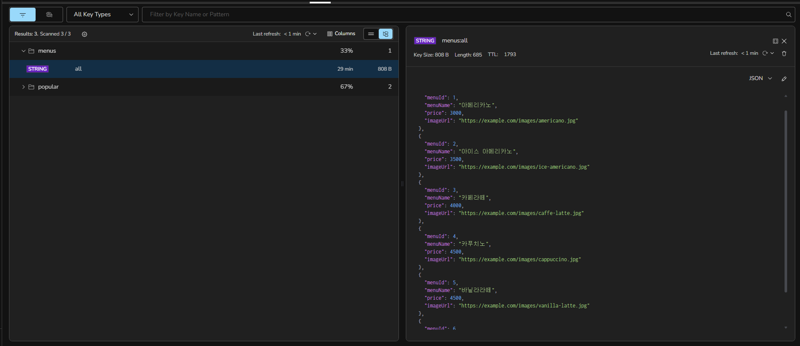

</div>

---

### 6. Redis Sorted Set — 인기 메뉴 집계

인기 메뉴를 DB에서 집계하면 주문이 많이 쌓였을 때 집계 쿼리가 무거워진다는 문제가 발생할 수 있습니다.

Redis Sorted Set의 `ZINCRBY`로 Score를 누적하고 `ZREVRANGE`로 상위 N개를 꺼내면 주문량이 늘어도 조회 성능이 일정하다는 장점을 활용했습니다.

```
날짜별 키 분리
popular:menus:2026-05-01  →  TTL 8일 (7일 집계 기간 + 1일 안전 마진)
popular:menus:2026-05-02  →  TTL 8일
...
ZUNIONSTORE로 7개 키 합산 → popular:menus:result에 저장 (TTL 1시간)
```

하지만, 매 요청마다 `ZUNIONSTORE`를 실행하면 트래픽이 증가할수록 Redis 부하가 증가하는 문제 생길 수 있습니다.

`result` 키를 1시간 캐싱하여 `ZUNIONSTORE`를 최대 1시간에 1번만 실행하도록 하고, 인기 메뉴 특성상 1시간 오차는 서비스에 영향이 없다고 판단했습니다.

**주문용과 검색용 카운터 분리**

주문은 실제 결제가 발생한 것이므로 전부 카운트되어야 하지만,

검색은 악의적인 요소들을 방지하기 위해 동일 유저가 5분 내 동일 메뉴를 반복 검색해도 1번만 카운트하는 중복 방지 로직을 적용했습니다.

```java
incrementMenuScoreByOrderCreate()  // 주문용 - 중복 방지 없이 전부 카운트
incrementMenuScoreBySearch()       // 검색용 - 5분 내 동일 유저/메뉴 중복 방지
```

<div align="center">

**RedisInsight - result키, 날짜별 집계 키**

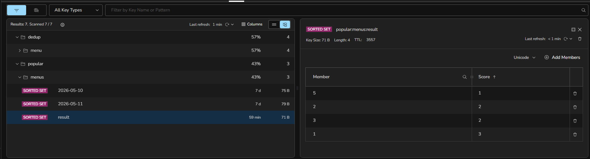
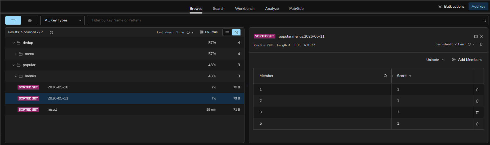

</div>

---

### 7. 소프트 딜리트 — 메뉴 삭제

메뉴를 하드딜리트로 삭제하면 두 가지 문제가 발생할 수 있다고 생각했습니다.

```
1. 기존 주문 내역의 menu_id FK가 참조 불가 → 데이터 정합성 문제
2. Redis Sorted Set에 해당 menuId의 score가 남아있어
   삭제된 메뉴가 인기 메뉴 TOP 3에 노출될 수 있는 문제
```

`@SQLDelete`와 `@SQLRestriction`을 활용하여 논리 삭제를 구현했습니다.

인기 메뉴 조회 시 DB JOIN 시점에 `@SQLRestriction`이 자동으로 `is_deleted = false` 조건을 추가하여 삭제된 메뉴가 인기 메뉴에 노출되는 문제를 방지할 수 있다고 생각하여 이렇게 구현해봤습니다.

```java
@SQLDelete(sql = "UPDATE menus SET is_deleted = true WHERE id = ?")
@SQLRestriction("is_deleted = false")
public class Menu extends BaseEntity { ... }
```

<br>

---

## 📊 K6 부하 테스트 결과

> 각 메커니즘이 실제로 동작하는지 기능 수준으로 검증하는 데 집중했습니다.

### 01 — 분산락: 100명 동시 주문

잔액 9,000P(아메리카노 3잔 분량)로 100명이 동시에 주문을 시도,

| 메트릭 | 기대값 | 실제값 | 결과 |
|--------|--------|--------|------|
| 주문 성공 건수 | 3 | 3 | ✅ |
| 잔액 부족 409 | 97 | 97 | ✅ |
| 최종 잔액 | 0P | 0P | ✅ |
| lock_wait_ms p95 | < 5,000ms | 796ms | ✅ |


<div align="center">

**K6 주문 분산락 테스트**

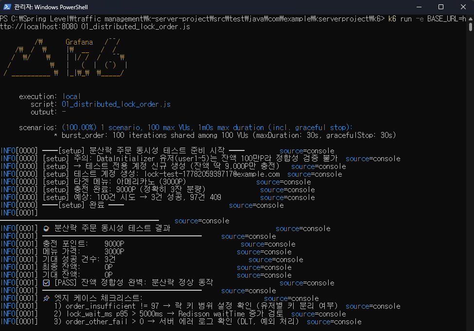
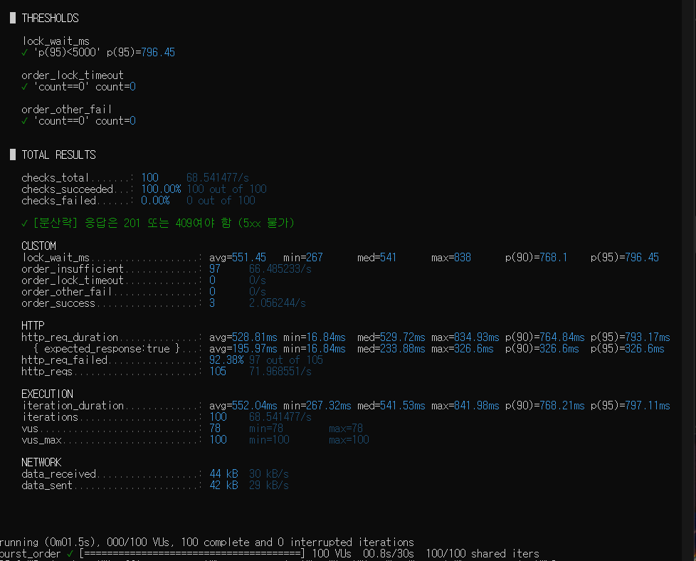

</div>

---

### 02 — 비관락: 50명 동시 포인트 충전

동일 계정에 50명이 동시에 1,000P씩 충전을 시도,

| 메트릭 | 기대값 | 실제값 | 결과 |
|--------|--------|--------|------|
| 충전 성공 건수 | 50 | 50 | ✅ |
| 최종 잔액 | 스냅샷 + 50,000P | 1,679,000P | ✅ |
| 데드락 발생 | 0 | 0 | ✅ |
| 유효성 검증 (0원 충전 시도) | 400 × 10 | 400 × 10 | ✅ |


<div align="center">

**K6 포인트 충전 테스트**

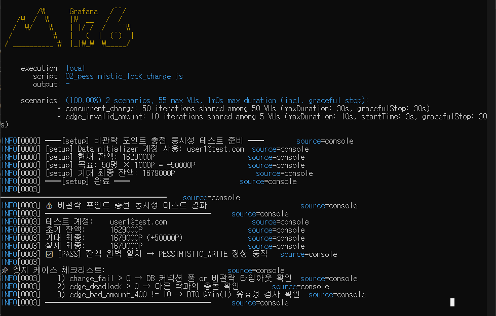
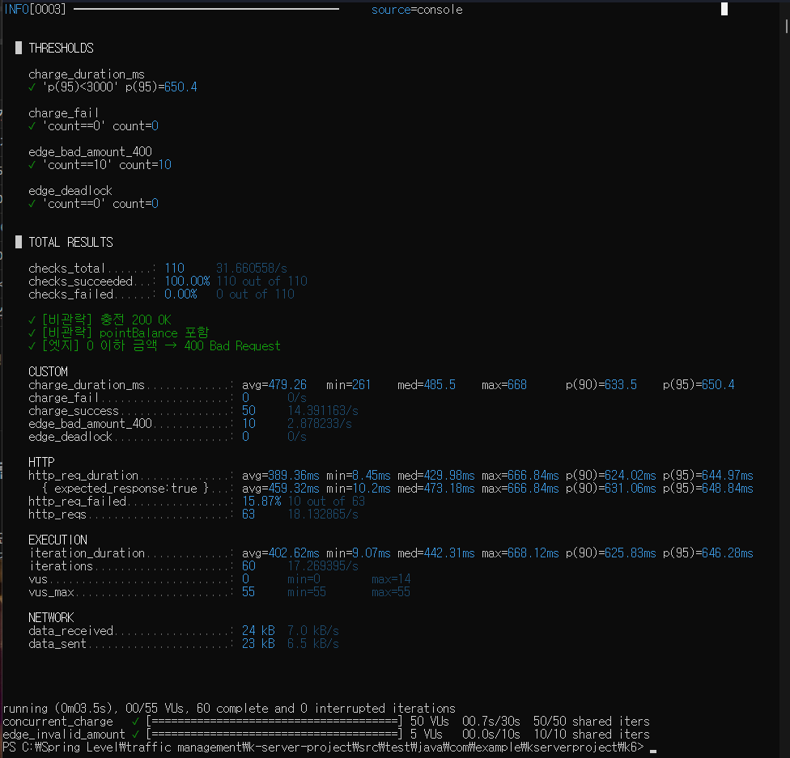

</div>

---

### 03 — Redis 캐싱: 200명 동시 메뉴 조회

**GET /api/menus — Redis 캐시 적중률 검증**

| 메트릭 | 기대값 | 실제값 | 결과 |
|--------|--------|--------|------|
| Cold Start 응답시간 | 기록 | 13ms | ✅ |
| Warm Start 응답시간 | 기록 | 6ms | ✅ |
| menu_list_duration_ms p95 | < 100ms | 87ms | ✅ |
| cache_hit vs cache_miss | hit >> miss | 32,057 vs 9 | ✅ |
| consistency_fail | 0 | 0 | ✅ |

<div align="center">

**K6 메뉴 목록 조회 Redis 캐시 테스트**

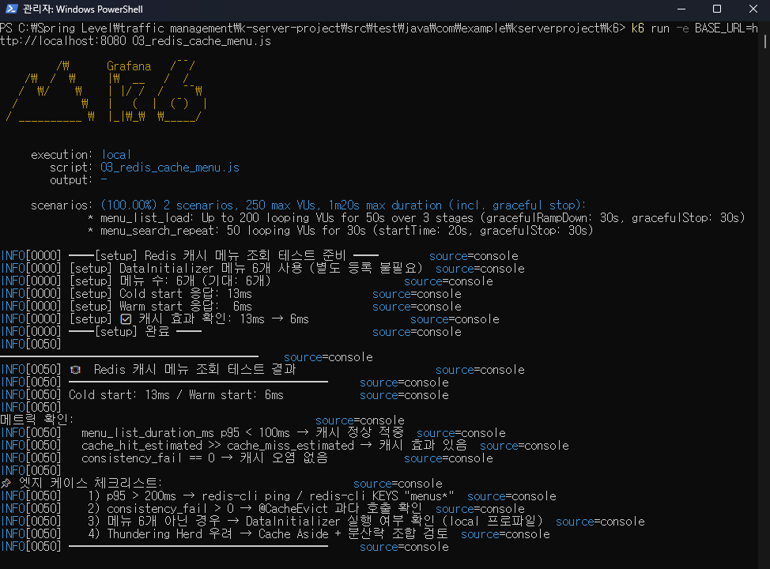
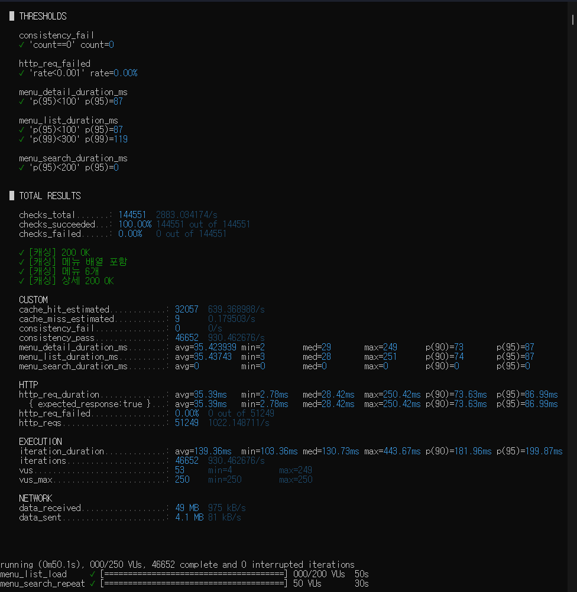

</div>

---

### 04 — Kafka 정합성: 60건 주문 메시지 유실 검증

5명의 유저가 아메리카노를 각 12건씩 주문하여 총 60건의 Kafka 메시지가 유실 없이 처리되는지 검증,

| 메트릭 | 기대값 | 실제값 | 결과 |
|--------|--------|--------|------|
| 주문 성공 건수 | 60 | 60 | ✅ |
| 카운트 증가분 | 60 | 60 | ✅ |
| DLT 메시지 수 | 0 | 0 | ✅ |
| Consumer Lag | 0 | 0 | ✅ |
| kafka_publish_duration_ms p95 | < 2,000ms | 449ms | ✅ |


<div align="center">

**K6 Kafka 정합성 테스트**

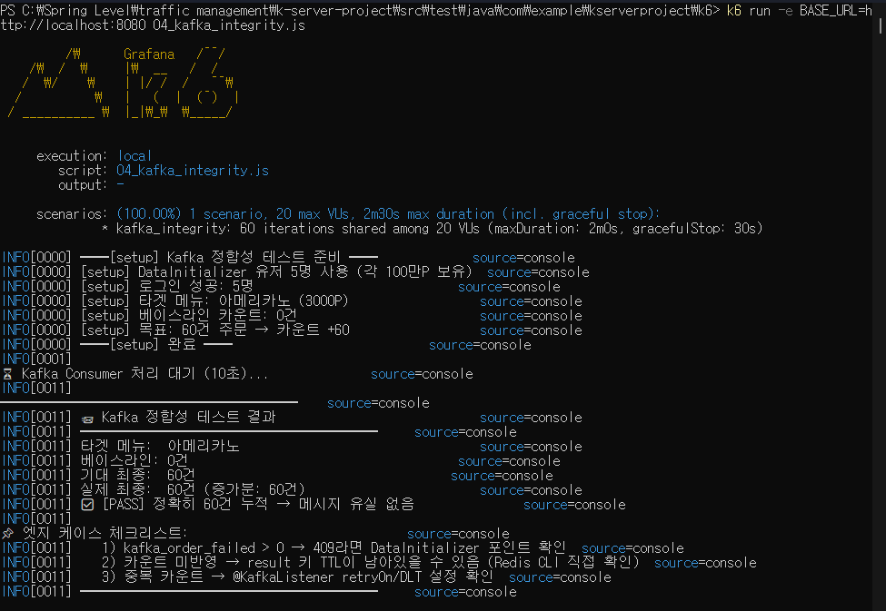
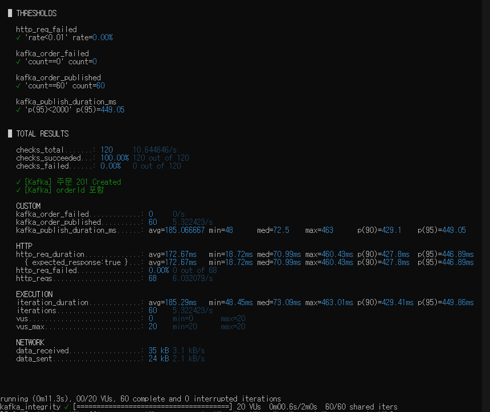

</div>

---

### 05 — Sorted Set: 200명 동시 인기 메뉴 조회

시드 주문(아메리카노 30건, 아이스 아메리카노 20건, 카페라떼 10건) 후 200명이 동시에 인기 메뉴를 조회,

| 메트릭 | 기대값 | 실제값 | 결과 |
|--------|--------|--------|------|
| popular_duration_ms p95 | < 50ms | 23ms | ✅ |
| consistency_mismatch | 0 | 0 | ✅ |
| TOP 1위 | 아메리카노 | 아메리카노 | ✅ |
| TOP 2위 | 아이스 아메리카노 | 아이스 아메리카노 | ✅ |
| TOP 3위 | 카페라떼 | 카페라떼 | ✅ |

<div align="center">

**K6 Sorted Set 테스트**

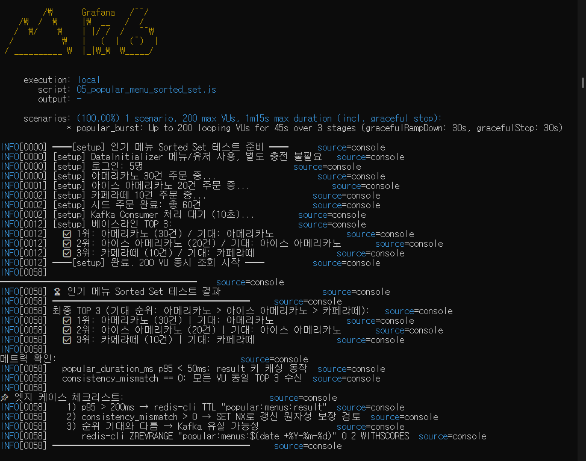
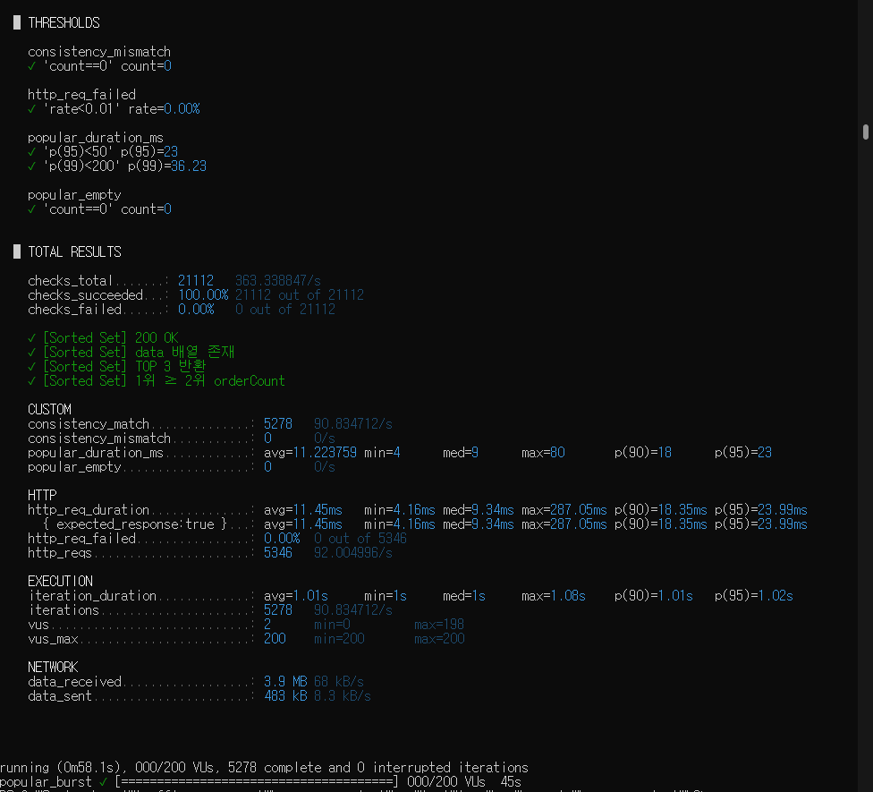

</div>

<br>

---

## 🔧 트러블슈팅

### 1. Redis 캐시 역직렬화 오류 (MismatchedInputException)

**문제**

K6 부하 테스트 중 `GET /api/menus` 호출 시 500 에러 발생.

```
Caused by: com.fasterxml.jackson.databind.exc.MismatchedInputException:
Unexpected token (START_ARRAY), expected VALUE_STRING
```

**원인**

`spring-data-redis 3.5.x`에서 `GenericJackson2JsonRedisSerializer` 내부에 `JacksonObjectReader`가 도입되었는데,

`Object` 타입으로 역직렬화할 때 `activateDefaultTyping` 설정과 충돌이 발생했었습니다.

`AsProperty`로 설정해도 내부에서 `AsArray`로 폴백하는 버그였습니다.

**해결**

`@Cacheable + GenericJackson2JsonRedisSerializer` 조합을 버리고 `StringRedisTemplate + ObjectMapper`로 직접 캐시를 관리하는 방식으로 전환했습니다.

`spring-data-bom` 버전도 `2024.0.8`로 고정했습니다.

---

### 2. StackOverflowError — pExpire 무한 재귀

**문제**

`stringRedisTemplate.expire(key, time, TimeUnit.DAYS)` 호출 시 `StackOverflowError` 발생.

```
at DefaultedRedisConnection.pExpire(DefaultedRedisConnection.java:220)
at DefaultedRedisConnection.pExpire(DefaultedRedisConnection.java:220)
...
```

**원인**

`spring-data-redis 3.5.6`의 `DefaultedRedisConnection.pExpire()`가 자기 자신을 무한 재귀 호출하는 버그였습니다.

**해결**

`TimeUnit` 오버로드 대신 `Duration` 오버로드로 변경했습니다.

```java
// 변경 전
stringRedisTemplate.expire(dateKey, 8, TimeUnit.DAYS);

// 변경 후
stringRedisTemplate.expire(dateKey, Duration.ofDays(8));
```

---

### 3. @WebMvcTest에서 jpaMappingContext 빈 생성 실패

**문제**

`AuthController`에 대한 `@WebMvcTest` 슬라이스 테스트 9개가 모두 실패.

```
Error creating bean with name 'jpaAuditingHandler':
Cannot resolve reference to bean 'jpaMappingContext'
```

**원인**

메인 클래스에 `@EnableJpaAuditing`이 붙어있어 `@WebMvcTest` 슬라이스 컨텍스트에서 JPA 빈을 찾지 못하는 문제가 발생을 했습니다.

**해결**

`@EnableJpaAuditing`을 별도 `JpaAuditingConfig` 클래스로 분리하고, 테스트에서 해당 설정을 `excludeFilters`로 제외했습니다.

---

### 4. Kafka 인기 메뉴 카운트 증가분 0건

**문제**

K6 Kafka 정합성 테스트에서 60건 주문 후 카운트 증가분이 0건으로 나오는 문제,

**원인**

검색용 중복 방지 로직(`dedup` 키, 5분 TTL)이 주문 이벤트 처리에도 그대로 적용되고 있어서

유저당 첫 1건만 카운트되어 5명 × 1건 = 5건만 반영이 되고 있었습니다.

**해결**

주문용(`incrementMenuScoreByOrderCreate`)과 검색용(`incrementMenuScoreBySearch`) 메서드를 분리했습니다.

주문은 실제 결제가 발생한 것이므로 중복 방지 없이 전부 카운트하고, 검색은 5분 내 동일 유저/메뉴 중복을 방지하는 방식으로 책임을 분리했습니다.

<br>

---

## 🚀 실행 방법

### 사전 요구사항

- Java 17
- Docker, Docker Compose
- K6 (부하 테스트 시)

### 1. 저장소 클론

```bash
git clone https://github.com/Ho-jin98/k-server-project.git
cd k-server-project
```

### 2. 환경 변수 설정

프로젝트 루트에 `.env` 파일을 생성한다.

```env
MYSQL_ROOT_PASSWORD=your_password
MYSQL_DATABASE=k_server_project
JWT_SECRET=your_jwt_secret
```

### 3. 인프라 실행

```bash
docker-compose up -d
```

| 서비스 | 포트 | 설명 |
|--------|------|------|
| MySQL | 3306 | 데이터베이스 |
| Redis | 6379 | 캐시, 분산락 |
| RedisInsight | 5540 | Redis UI |
| Kafka | 9092 | 메시지 브로커 |
| Kafka UI | 8088 | Kafka 관리 |

### 4. 애플리케이션 실행

```bash
./gradlew bootRun --args='--spring.profiles.active=local'
```

### 5. 더미 데이터 (DataInitializer)

`local` 프로파일로 실행 시 자동으로 생성된다.

| 계정 | 이메일 | 비밀번호 | 포인트 |
|------|--------|----------|--------|
| ADMIN | admin@test.com | password123! | 0P |
| CUSTOMER | user1~5@test.com | password123! | 1,000,000P |

메뉴: 아메리카노(3,000P), 아이스 아메리카노(3,500P), 카페라떼(4,000P), 카푸치노(4,500P), 바닐라라떼(4,500P), 카라멜 마키아토(5,000P)

### 6. K6 부하 테스트

```bash
# 분산락 테스트
k6 run -e BASE_URL=http://localhost:8080 src/test/java/com/example/kserverproject/k6/01_distributed_lock_order.js

# 비관락 테스트
k6 run -e BASE_URL=http://localhost:8080 src/test/java/com/example/kserverproject/k6/02_pessimistic_lock_charge.js

# Redis 캐시 테스트
k6 run -e BASE_URL=http://localhost:8080 src/test/java/com/example/kserverproject/k6/03_redis_cache_menu.js

# Kafka 정합성 테스트
k6 run -e BASE_URL=http://localhost:8080 src/test/java/com/example/kserverproject/k6/04_kafka_integrity.js

# 인기 메뉴 Sorted Set 테스트
k6 run -e BASE_URL=http://localhost:8080 src/test/java/com/example/kserverproject/k6/05_popular_menu_sorted_set.js
```

<div align="center">


</div>